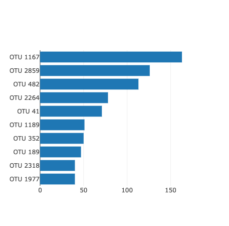
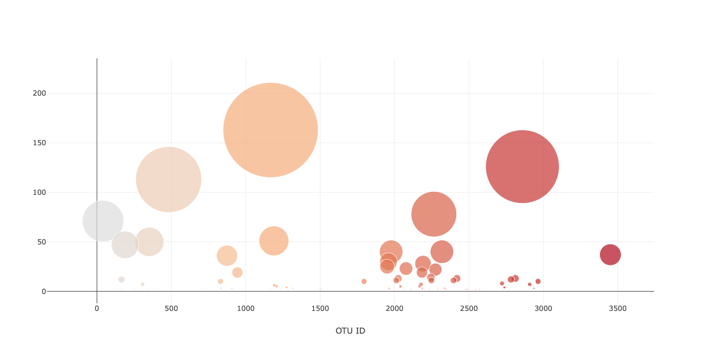
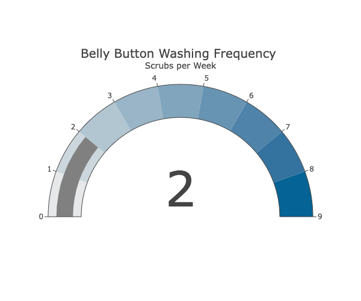
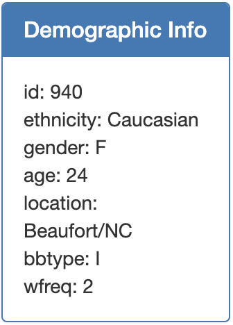

# Belly Button Challenge
## Glen Dagger

### Module 14 Challenge

For this assignment, I used my knowledge of Javascript, HTML, and the D3 library to build an interactive dashboard that explores the [Belly Button Biodiversity dataset](./samples.json). 

All code is included in the [app.js](./static/js/app.js) file, located in the static/js subdirectory of the main repository.

## Project Overview

The most challenging part of this assignment was determining the overall flow and order of functionality in the code. One of the major breakthroughs in this process was determining that the API calls through D3 had to either be made separately within each function or include all functions within a single ".then" call to the API. I ultimately decided to break the tasks up into four functions, with separate D3 API calls contained in each.

# Function 1: createCharts
This function was my starting point for building the dashboard. The createCharts function takes in a single sampleID string as its only argument with a default value. I initialized the default value at the beginning of the code as a variable called *defaultID* set to '940'. Using a variable here makes it easier to update this default value in the future by simply changing its value in the first line.

The function then extracts the data for that sample from the API using the D3 library and stores the necessary data in variables (*samples*, *sampleData*, *otu_ids*, *sample_values*, and *otu_labels*.)

Using the extracted data, the function then creates the charts and displays them in their respective *div* elements in the HTML.

The bar chart displays the top ten OTUs for the selected individual as a horizontal bar chart. It uses the *sample_values* as the values on the x-axis, *otu_ids* as the labels on the y-axis, and *otu_labels* as the hovertext.

 

The bubble chart displays all OTU data for the selected individual. It uses *otu_ids* for the x values and marker colors, *sample_values* for the y values and marker size, and *otu_labels* for the hovertext values. This chart is an interesting choice for this data, particularly since the *otu_ids* and *sample_values* are represented by more than one attribute. At first glance, it may be a bit unclear what exactly is being represented by this visualization.

 

For the additional bonus, I added the gauge chart that plots the weekly washing frequency of the selected individual. I had difficulty figuring out how to add this to a separate "bonus.js" file due to the way I structured my code, particularly since the "optionChanged" function was already defined in the main file. I found it more straightforward to include it in the original "createCharts" function. 
I created a version that shows the *wfreq* value for the selected individual on the indicator. Since all of these values appeared to be integers, I felt it made more sense to label each "step" on the gauge by discrete integer values rather than the fairly ambiguous ranges depicted in the image. 
On its own, this function correctly creates the charts when a sample ID is entered as an argument, but at this point is not connected to the dropdown menu or selection and must be changed within the app.js file itself.

## Function 2: getMetadata
The next step was to pull data for and populate the demographic information panel for any given sample ID. This function takes in a sample ID as an argument and uses the D3 library to make an API call to the JSON data and pull the metadata for that selected individual. In order to customize the text formatting, I created two separate arrays for the keys and values from the metadata. I used D3 to select the panel body element and reset the HTML to clear out any existing data. I then looped through and appended a separate "text" element to the panel body for each key value pair and added the information, formatted "key: value". I then appended a new line character after each piece of information, except the last one.

## Function 3: createDropdownMenu()

The next step was to create the dropdown menu and use D3 to identify the selected ID to be used as an input for the previous two functions. This would serve to update the charts and metadata based on the selected individual.
In order to achieve this, I used D3 to make an API call to the provided url and store the "names" data as an array of sample IDs. I then used a for loop to iterate through the array and select the dropdown, add a new "option" element, and set its text to the element ID for each name.
At this point, calling all three of these functions showed that the page was visually where I wanted it to be, but still lacked functionality that related the dropdown menu to the data and visualizations. 

## Function 4: optionChanged

The final function takes in the sampleID as its argument and updates the charts and metadata to represent the selected individual. In the HTML code, the "onchange" attribute of the dropdown menu sets the value to "optionChanged(this.value)", which means when a different ID is selected from the dropdown, the optionChanged function is called with the selected ID as its argument. 
The final piece was to call the createCharts and getMetadata functions within the optionChanged function, using the same ID as their inputs.

The final piece to complete the dashboard was to call the createDropdownMenu function on its own to create the dropdown menu and call the createCharts and getMetadata functions to initialize the three charts and demographic information. 
Testing various values confirmed that all plots are updated to show information for the selected ID.